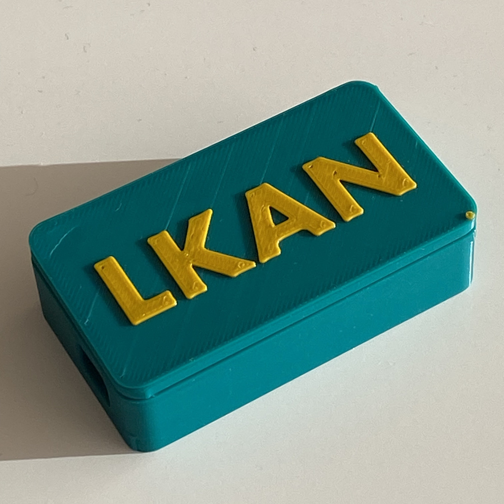
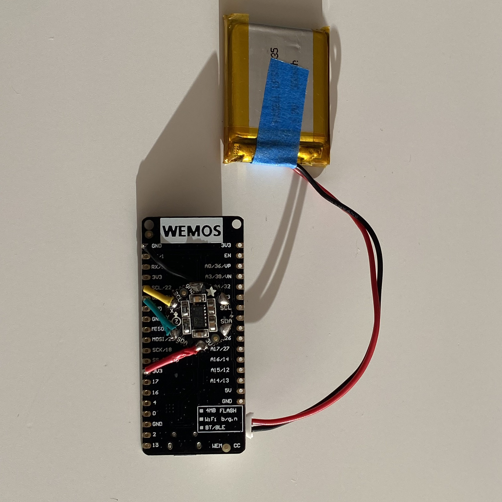
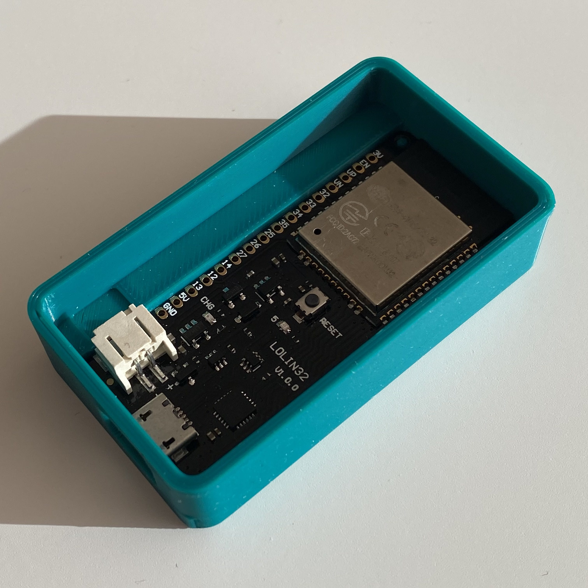
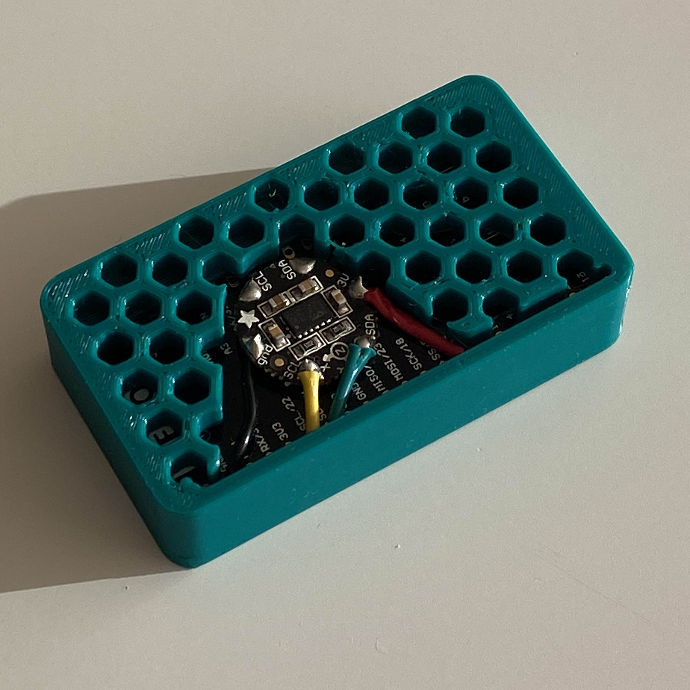
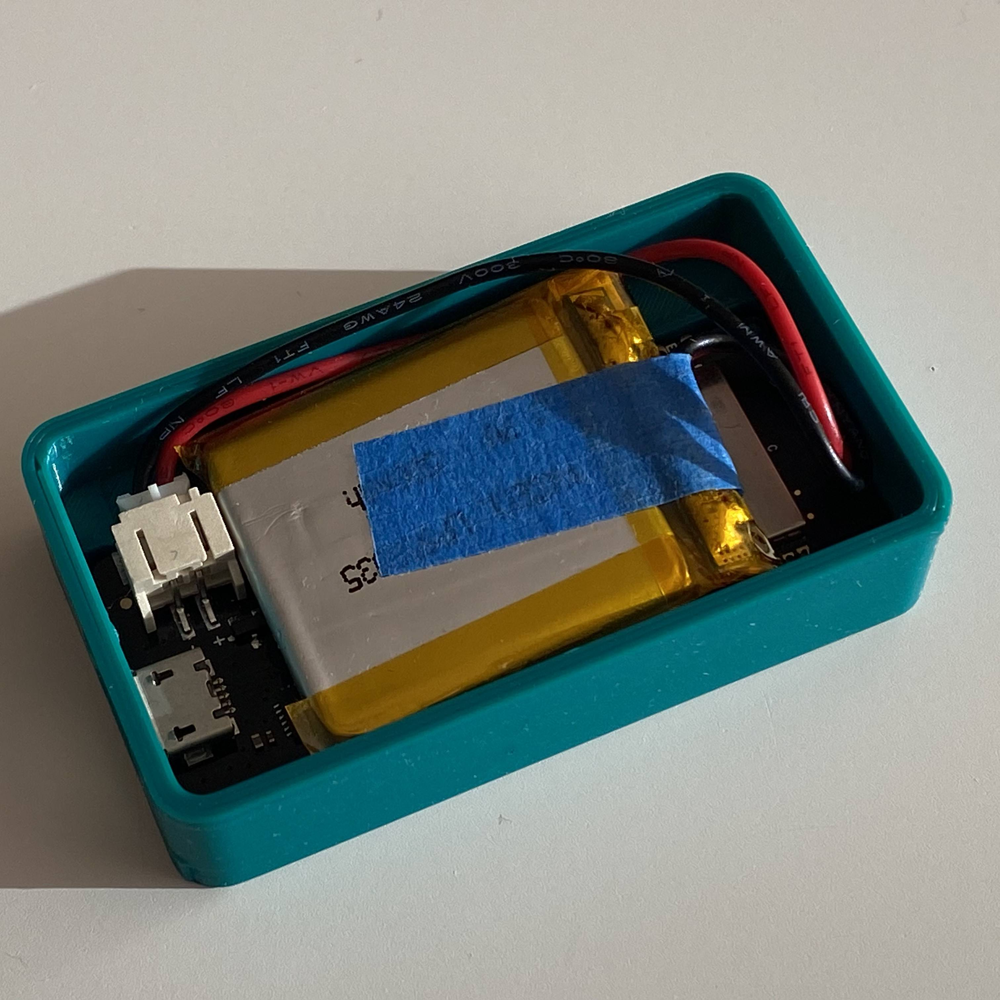

# Saltómetro
El Saltómetro es un contador que registra  los saltos de la cantante de LKAN durante sus conciertos.

<p align="center">
  
&nbsp;
<video width="40%" controls muted="false">
  <source src="assets/saltometro_6.mp4" type="video/mp4">
  Tu navegador no soporta la reproducción de videos.
</video>
</p>


## Hardware
* LOLIN D32. Sirve cualquier módulo ESP32 con Bluetooth.
* Acelerómetro Flora LSM303DLHC. Sirve cualquier acelerómetro compatible. El pin SCL del acelerómetro está conectado directamente al pin SCL del LOLIN, y el pin SDA del acelerómetro está conectado directamente al pin SDA del LOLIN.
* Una batería compatible con el LOLIN.
* Un ordenador, que recibe las pulsaciones del teclado simulado por el LOLIN.

<p align="center">




</p>

## Software
### Arduino (probado con el IDE 2.3.3)
#### Configuración
Como usamos un ESP32, necesitamos abrir el Boards Manager e instalar la librería ESP32 de Espressif, la versión 2.0.11 (las versiones más recientes son incompatibles).

Para el acelerómetro estamos usando la librería Adafruit LSM303 Accel, disponible en el Library Manager. Aquí estamos usando la versión más reciente (la 1.1.8, cuando escribo esto).

#### El programa
El programa convierte el dispositivo en un contador de saltos que se comunica por Bluetooth como si fuera un teclado. Cada vez que detecta un salto, envía un '1' al ordenador conectado.

#### Funcionamiento a grandes rasgos
* Se conecta por Bluetooth como si fuera un teclado.
* Detecta saltos midiendo la aceleración en los tres ejes (X, Y, Z).
* Usa el LED integrado que se enciende/apaga para indicar las fases del salto.

#### Funcionamiento detallado
El sketch crea un teclado Bluetooth llamado "Saltometro". A continuación, se pone a analizar continuamente los datos que le devuelve el acelerómetro. Usamos una media móvil (es decir, hacemos la media de las últimas `WINDOW_SIZE` lecturas del acelerómetro) para suavizar el ruido del sensor. Además, usamos la magnitud de la aceleración para no tener que preocuparnos de colocar el acelerómetro en una posición determinada.

El programa detecta dos fases del salto:

1. Inicio del salto: Cuando la aceleración es menor que `THRESHOLD_JUMP_START`, no estamos en medio de un salto (`!inJump`), y ha pasado suficiente tiempo desde el último salto detectado (`(currentTime - lastJumpTime) > DEBOUNCE`) es que ha empezado el salto.
2. Aterrizaje: Cuando estamos en medio de un salto (`inJump`), la aceleración filtrada supera THRESHOLD_JUMP_LAND, y la duración del salto está dentro de los límites razonables (`jumpDuration > MIN_JUMP_DURATION && jumpDuration < MAX_JUMP_DURATION`), significa que hemos 'aterrizado' y simulamos la pulsación de la tecla '1' en nuestro teclado Bluetooth.

#### ¿Qué podemos configurar?
En este bloque podemos configurar los parámetros que controlan la detección de saltos: el umbral de despegue y aterrizaje, el tiempo entre saltos, el número de muestras que usamos para promediar el valor del acelerómetro y la duración mínima y máxima del salto.
```c
#define THRESHOLD_JUMP_START 5.0  // Umbral para detectar el inicio del salto (en g)
#define THRESHOLD_JUMP_LAND 15.0  // Umbral para detectar el aterrizaje (en g)
#define DEBOUNCE 150UL            // Tiempo de debounce en ms
#define WINDOW_SIZE 5             // Tamaño de la ventana para el filtro
#define MIN_JUMP_DURATION 100     // Duración mínima del salto en ms
#define MAX_JUMP_DURATION 500     // Duración máxima del salto en ms
```

#### Bola extra
##### Modo pasadiapositivas
Si descomentamos la línea `// #define PASADIAPOS`, el teclado mandará la tecla 'flecha derecha', pudiendo pasar a saltos las diapos de una presentación.

##### Información de debug
Si comentamos descomentamos la linea `#define DEBUG`,  se ocultará o mostará información adicional sobre la intensidad y duración de los saltos. 

### Processing
Para visualizar el número de saltos, hemos creado un programa en Processing que muestra un contador animado.

#### Funcionamiento a grandes rasgos
* Cuando el Saltómetro detecta un salto, envía un '1' al ordenador.
* Processing recibe ese '1' como una pulsación de teclado.
* Por cada pulsación de teclado, se incrementa el contador de saltos y se muestra con una animación en pantalla.

#### Funcionamiento detallado
El programa usa dos clases:

`JumpCounter`: Representa cada número individual
* Controla la posición, rotación y tiempo de vida de cada número.
* El número aparece aleatoriamente en un área centrada en la pantalla.
* El número se desvanece gradualmente durante 50 frames.


`saltometro_processing`: Programa principal
* Mantiene una lista de todos los `JumpCounter` activos.
* Gestiona el contador global de saltos.
* Actualiza y dibuja todos los contadores en cada frame.
* Elimina los contadores cuando terminan su animación.

#### Controles de teclado
* Pulsando la tecla '1', se incrementa el contador y aparece una nueva animación.
* Pulsando la tecla 'z' se reinicia el contador a cero.